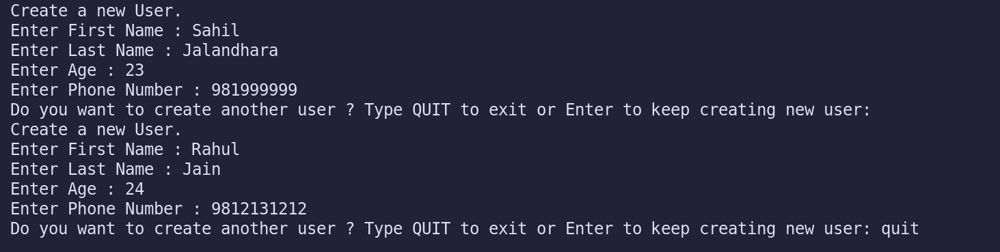
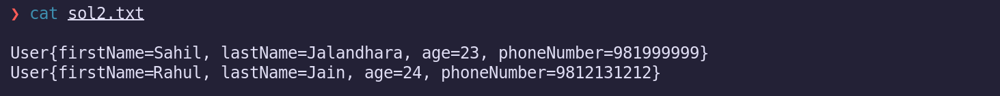

# Question 1 Write a program to display values of enums using a constructor & getPrice() method (Example display house & their prices)

# Answer 1

```java
public class EnumDisplay {

    public static void main(String[] args) {
       for (Houses h : Houses.values()) {
           System.out.println("Price of " + h.name()+" house is "+h.getPrice());
       } 
    }

}

enum Houses {
    SMALL(500000), MEDIUM(800000), LARGE(900000), MANSION(10000000);

    private int price;

    Houses(int price) {
        this.price = price;
    }

    public int getPrice() {
        return price;
    }
    
}
```

 

# Question 2 Create a User class with fields: firstname, lastname, age, phonenumber. Write a program which accepts values of user fields from commandline, create object and append that to a text file. After every user creation the program should prompt: "Do you want to continue creating users? (Type QUIT to exit)" and keep on accepting values and writing to file unitl user quits.

# Answer 2

### Java Code

```java

import java.io.BufferedWriter;
import java.io.File;
import java.io.FileWriter;
import java.io.IOException;
import java.util.Scanner;

public class Sol2 {

    public static void main(String[] args) {
        Scanner input = new Scanner(System.in);
        File file = new File("sol2.txt");
        try {
            file.createNewFile();
        } catch (IOException e) {
            System.out.println("Failed to create file");
            e.printStackTrace();
        }
        do {
            try (var br = new BufferedWriter(new FileWriter(file,true))) {
                System.out.println("Create a new User.");
                System.out.print("Enter First Name : ");
                String firstName = input.nextLine();
                System.out.print("Enter Last Name : ");
                String lastName = input.nextLine();
                System.out.print("Enter Age : ");
                int age = input.nextInt();
                input.nextLine();
                System.out.print("Enter Phone Number : ");
                String number = input.nextLine();
                br.write(new User(firstName, lastName, age, number).toString());
                br.newLine();
                br.flush();
                System.out.print("Do you want to create another user ? Type QUIT to exit or Enter to keep creating new user: ");
                String line = input.nextLine();
                if (line.equalsIgnoreCase("QUIT")) {
                   break; 
                }
            } catch (IOException e) {
                System.out.println(e);
            }
        } while (true);
        input.close();
    }

}

class User {
    private String firstName;
    private String lastName;
    private int age;
    private String phoneNumber;

    public User(String firstName, String lastName, int age, String phoneNumber) {
        this.firstName = firstName;
        this.lastName = lastName;
        this.age = age;
        this.phoneNumber = phoneNumber;
    }

    @Override
    public String toString() {
        return "User{firstName=" + firstName + ", lastName=" + lastName + ", age=" + age + ", phoneNumber="
                + phoneNumber + "}";
    }
}

```

###  Images
 
 


# Question 3 Write a program to count number of occurrences of a word in a file. The file name and word should be supplied through commandline.

# Answer 3

```java
import java.io.BufferedReader;
import java.io.File;
import java.io.FileReader;
import java.io.IOException;
import java.util.Scanner;

public class SearchWord {

  public static void main(String[] args) {
    Scanner scanner = new Scanner(System.in);
    System.out.println("Search occurences of a word in file.");
    System.out.print("Enter word: ");
    String word = scanner.nextLine();
    System.out.print("Enter file name: ");
    String fileName = scanner.nextLine();
    int count = 0;
    File file = new File(fileName);
    try (var br = new BufferedReader(new FileReader(file))) {
      String line;
      while ((line = br.readLine()) != null) {
        String[] words = line.split(" ");
        for (String wrd : words) {
          if (wrd.equals(word)) {
            count++;
          }
        }
      }
    } catch (IOException e) {
        System.out.println("Error : " + e.getMessage());
    }
    System.out.printf("Occurences of word : %s , is %d \n",word,count );
    scanner.close();
  }
}
```

### Images
 

# Question 4 Write a program to show application of Factory Design Pattern.

# Answer 4

```java

// Product Interface
interface Animal {
    void sound();
}

class Dog implements Animal {
    public void sound() {
        System.out.println("Dog says: woof!");
    }
}

class Cat implements Animal {
    public void sound() {
        System.out.println("Cat says: meow!");
    }
}

// Factory Class
class AnimalFactory {
    public static Animal getAnimal(String type) {
        if (type.equals("DOG")) {
            return new Dog();
        } else if (type.equals("CAT")) {
            return new Cat();
        }
        return null;
    }
}

public class Main {
    public static void main(String[] args) {
        Animal a1 = AnimalFactory.getAnimal("DOG");
        a1.sound();  // Output: Dog says: woof!

        Animal a2 = AnimalFactory.getAnimal("CAT");
        a2.sound();  // Output: Cat says: meow!
    }
}

```

# Question 5 Write a program to show application of Singleton Design Pattern.

# Answer 5

```java
class Singleton {

    private static Singleton instance;

    private Singleton(){
        System.out.println("Constructor Called");
    }

    public static Singleton getInstance(){
        if (instance == null) {
            instance = new Singleton();
        }
        return instance;
    }

    public static void doSomething(){
        System.out.println("Doing some work");
    }
    
}

public class SDP{
    public static void main(String[] args) {
        var obj = Singleton.getInstance();
    }
}
```
